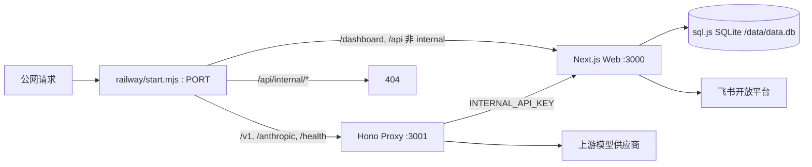
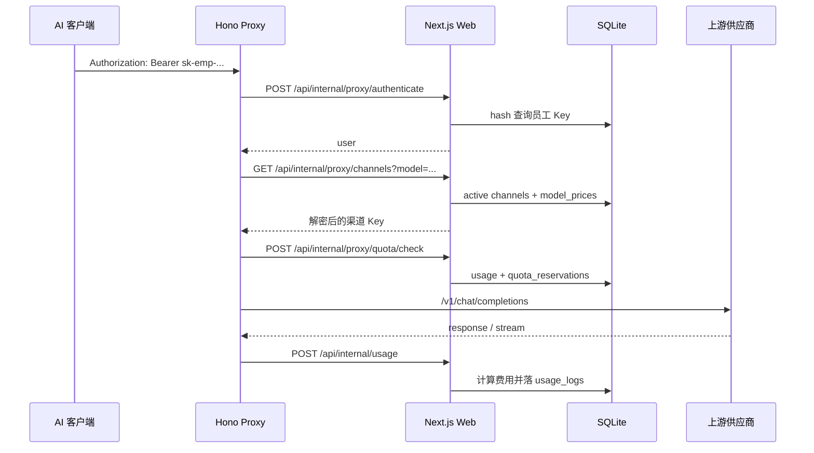

# 系统架构

最后更新：2026-06-18

本文档按当前代码描述 Sparkloom 的生产架构。

## 1. 架构结论

当前线上不是两个公网服务，也不是传统 Nginx 反代。当前线上是：

- Railway 单镜像。
- 容器内双进程。
- `railway/start.mjs` 做入口层转发。
- Web 是唯一数据库 owner。
- Proxy 不直接读写 SQLite。

## 2. 进程拓扑

## 3. 路由分发

代码：`railway/start.mjs`

| 路径 | 目标 | 说明 |
| --- | --- | --- |
| `/health` | Proxy | 公网健康检查 |
| `/v1/*` | Proxy | OpenAI 兼容模型接口 |
| `/anthropic/*` | Proxy | Claude Code / Anthropic 兼容接口 |
| `/api/internal/*` | 入口层 404 | 禁止公网访问 |
| 其他路径 | Web | 登录页、Dashboard、管理 API |

入口层还负责：

- 限制请求体大小，默认 `MAX_REQUEST_BODY_BYTES=2097152`。
- 注入 `x-forwarded-host` 和 `x-forwarded-proto`。
- 子进程异常退出时关闭容器。
- SIGTERM/SIGINT 时优雅退出。

## 4. Web 职责

代码根目录：`web/`

Web 负责：

- 登录页和 Dashboard。
- 飞书 OAuth。
- session/JWT。
- RBAC。
- 管理 API。
- 内部 API。
- SQLite 加载、迁移、写盘。
- 飞书通讯录同步。
- 飞书消息发送。
- 模型价格同步。
- 渠道余额同步。
- 额度和计费落库。
- 定时任务。

Web 是数据库唯一 owner。所有 DB 写入应由 Web 完成。

## 5. Proxy 职责

代码根目录：`proxy/`

Proxy 负责：

- `GET /v1/models`
- `POST /v1/chat/completions`
- `POST /anthropic/v1/messages`
- `POST /anthropic/v1/messages/count_tokens`
- 员工 API Key 鉴权。
- 请求限频。
- 渠道选择和 fallback。
- 请求上游供应商。
- 流式 SSE 透传。
- token usage 提取或估算。
- usage 持久队列和重试。

Proxy 不保存业务数据，只通过内部 API 访问 Web。

## 6. 数据库架构

数据库：sql.js SQLite 文件。

加载方式：

- Web 启动或首次访问时读取 `data.db` 到内存。
- 写入时导出内存 DB 到磁盘。
- `saveDb()` 立即保存。
- `scheduleSave()` 2 秒 debounce 保存。

路径优先级：

1. `DATABASE_URL` 是文件路径时。
2. `RAILWAY_VOLUME_MOUNT_PATH` 存在时使用 `${RAILWAY_VOLUME_MOUNT_PATH}/data.db`。
3. 默认 `./data.db`。

生产必须使用持久化路径。

## 7. 内部调用链

## 8. 定时任务架构

入口：`web/src/instrumentation.ts`

调度器：`web/src/lib/auto-sync.ts`

所有定时任务通过 HTTP 调用本服务 API，并带 `INTERNAL_API_KEY`：

- 飞书同步。
- 价格同步。
- 余额同步。
- 余额提醒。
- 异常检测。
- 员工状态检查。
- 排行榜发送检查。

时间均按北京时间计算。

## 9. 部署模式

当前推荐生产：

- Railway 单服务镜像。
- Railway Volume 挂载 `/data`。
- 只暴露 Railway 分配的 `PORT`。

保留的参考模式：

- `docker-compose.yml` 是双服务参考，不是当前线上真实拓扑。
- 如果未来切回 docker compose，必须保证 Web 是 DB owner，Proxy 仍通过内部 API 访问 Web。

## 10. 设计边界

必须保持：

- Web 和 Proxy 共用同一个 `INTERNAL_API_KEY`。
- `ENCRYPTION_KEY` 一旦用于生产数据，不可随意更换，否则旧密钥无法解密。
- `/api/internal/*` 不得公网暴露。
- Proxy 不直接操作 `data.db`。
- 上游供应商 Key 不返回给浏览器。
- 员工 Key 明文只展示一次。
