# AI Token Manager — 架构设计文档

> 最后更新：2025-06-08
> 本文档使用 Mermaid 图表语法，VS Code 安装 "Markdown Preview Mermaid Support" 插件可直接预览，GitHub 也原生支持。

---

## 一、系统架构总览

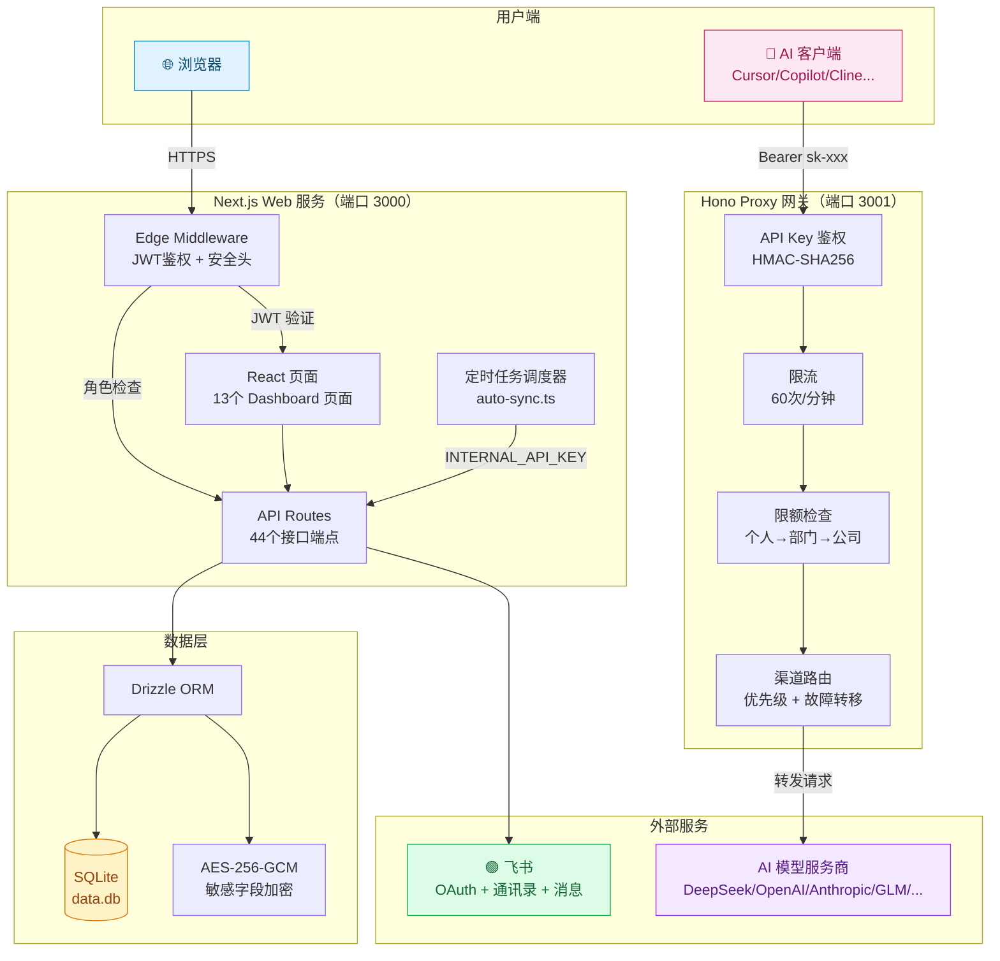

---

## 二、认证与鉴权流程

### 2.1 飞书 OAuth 登录流程

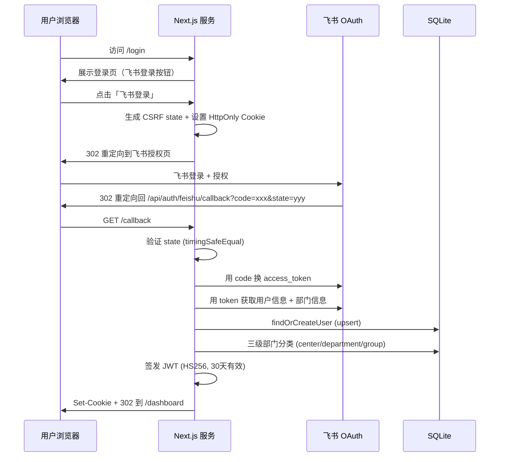

### 2.2 AI 请求鉴权流程

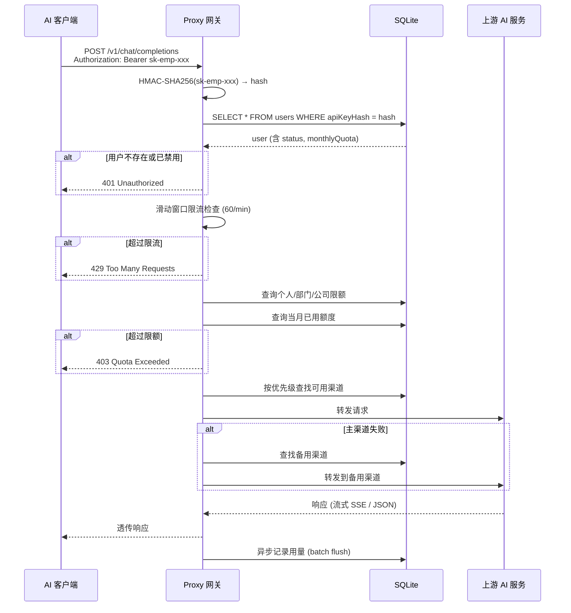

---

## 三、数据流架构

### 3.1 用量记录流水线

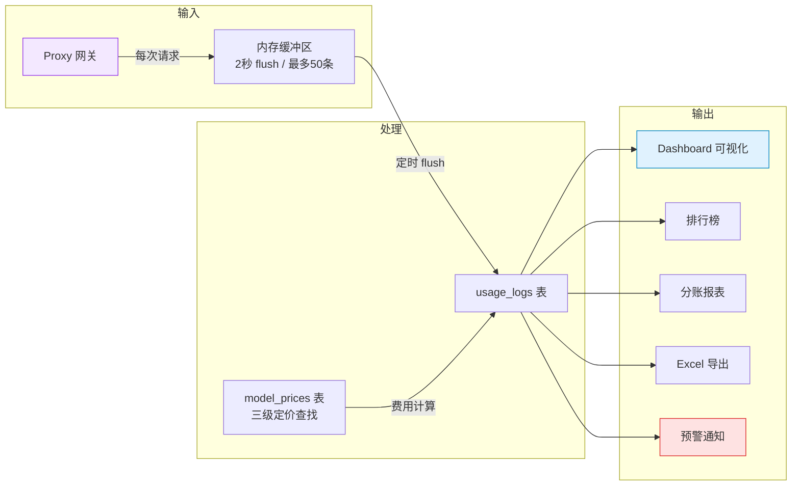

### 3.2 费用计算优先级

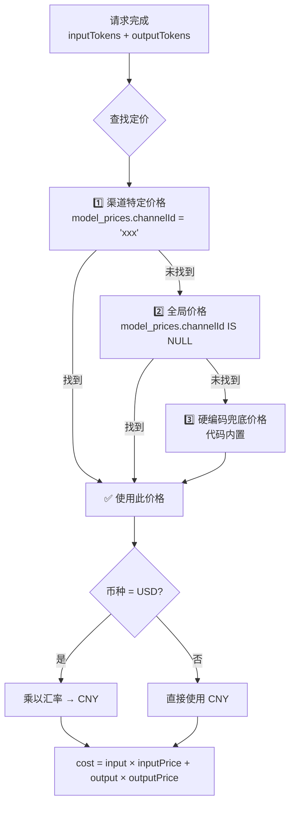

---

## 四、定时任务调度

```mermaid
gantt
    title 每日定时任务时间线
    dateFormat HH:mm
    axisFormat %H:%M

    section 启动时
    飞书+价格同步     :milestone, m1, 00:30, 0m
    余额同步          :milestone, m2, 01:00, 0m
    异常检测          :milestone, m3, 01:30, 0m
    员工状态检查      :milestone, m4, 02:00, 0m

    section 定时任务
    排行榜推送        :crit, t1, 10:00, 1m
    飞书员工同步      :active, t2, 12:00, 10m
    飞书员工同步(晚)  :active, t3, 19:00, 10m
    员工状态检查      :t4, 20:00, 5m
    模型价格同步      :t5, 03:00, 10m
    渠道余额同步      :t6, 04:00, 5m
    异常用量检测      :t7, 00:00, 60m
```

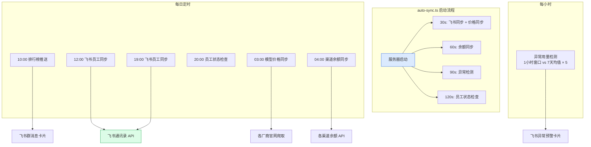

---

## 五、角色权限矩阵

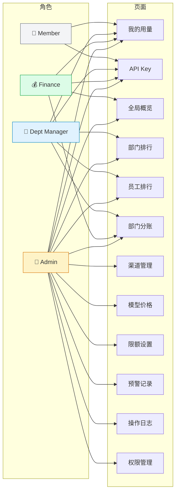

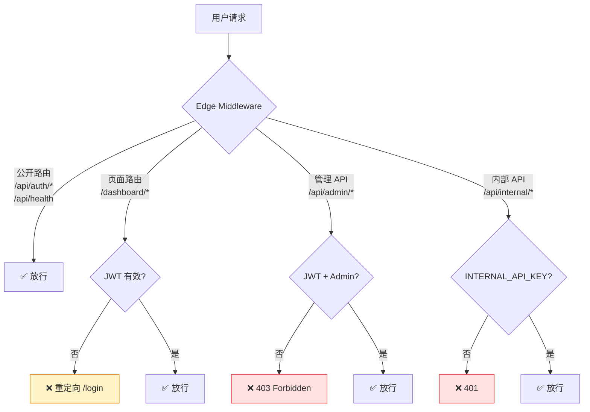

---

## 六、预警系统流程

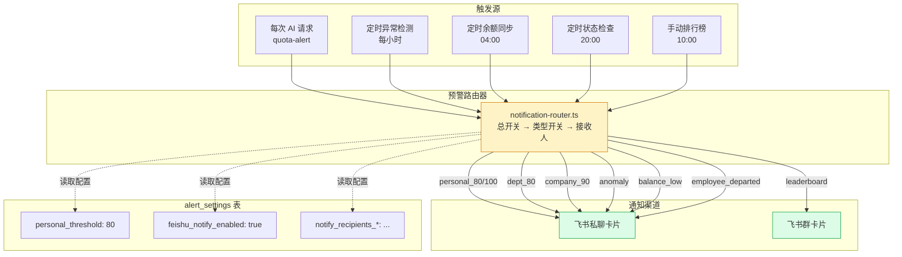

---

## 七、Docker 部署架构

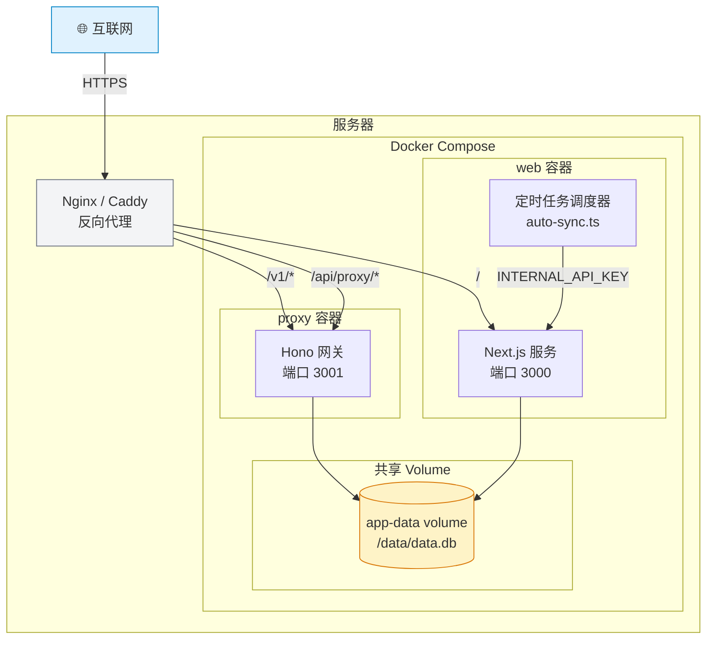

---

## 八、飞书数据同步流程

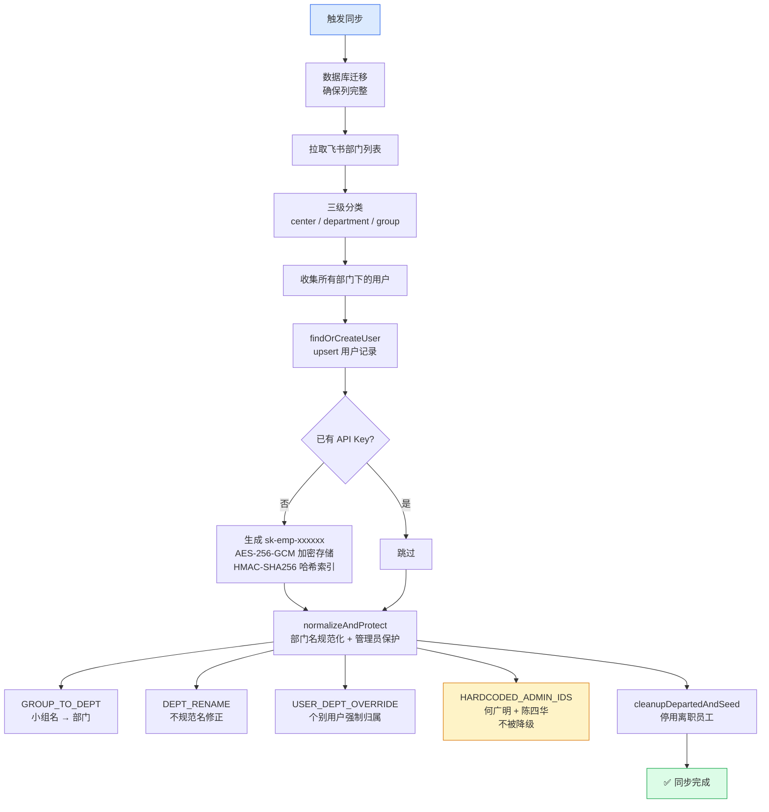

---

## 九、安全架构

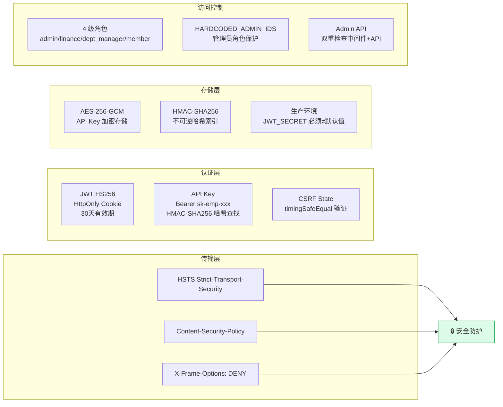
