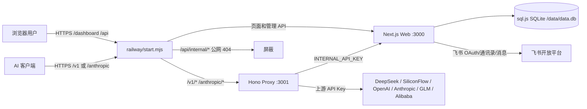
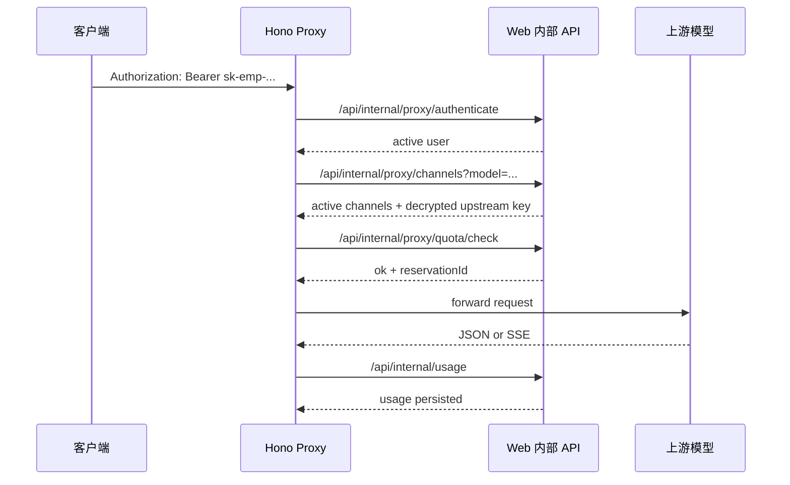

# Sparkloom 交接文档

最后更新：2026-06-20
线上地址：https://ai.seapllo.com
当前部署方式：Railway 单服务镜像，容器内同时运行 Next.js Web 和 Hono Proxy 两个进程。
文档定位：这是后续开发、Bug 修复、日常运维和用户支持的总交接入口。完整交接不能只依赖一个文档，后续团队应以 `docs/README.md` 中列出的文档套件为准。

---

## 0. 文档套件

一个总文档适合快速理解系统，但不足以支撑后续团队独立维护。当前已按代码重新整理为以下文档：

| 文档 | 用途 |
| --- | --- |
| `docs/README.md` | 文档索引和阅读路径 |
| `docs/HANDOVER.md` | 总交接说明 |
| `docs/ARCHITECTURE.md` | 当前 Railway 单镜像双进程架构 |
| `docs/PROJECT-MODULES.md` | 各模块功能、关键文件和维护规范 |
| `docs/API.md` | Public/Web/Internal API 契约 |
| `docs/DATABASE-SCHEMA.md` | SQLite 表结构、字段和迁移规范 |
| `docs/PROXY-INTERNALS.md` | Hono Proxy、限额预占、usage 队列和流式计费 |
| `docs/SECURITY-PERMISSIONS.md` | 权限、密钥、CSRF、SSRF、内部 API 和资金安全 |
| `docs/INCIDENT-RUNBOOK.md` | 事故分级、止血、回滚、密钥泄露和费用异常处理 |
| `docs/USER-GUIDE.md` | 员工、管理员、财务、部门负责人使用说明 |
| `docs/SUPPORT-RUNBOOK.md` | 一线管理员/客服 SOP、话术和升级标准 |
| `docs/OPERATIONS.md` | 部署、环境变量、定时任务、日常维护 |
| `docs/TROUBLESHOOTING.md` | 常见故障排查 |
| `docs/RELEASE-CHECKLIST.md` | 上线前回归检查清单 |
| `docs/balance-sync.md` | 渠道余额同步和提醒 |
| `docs/backup-restore.md` | 备份、恢复和计费重置 |
| `docs/monitoring.md` | 健康检查、日志、指标和告警 |
| `docs/reverse-proxy.md` | Railway 入口层和未来反代规则 |
| `docs/HANDOFF-BUSINESS-UAT-SIGNOFF.template.json` | 结构化业务 UAT 签收模板，实际签收文件不要提交 Git |
| `docs/HANDOFF-BACKUP-RESTORE-SIGNOFF.template.json` | 结构化备份恢复签收模板，实际签收文件不要提交 Git |
| `docs/HANDOFF-ASSET-SIGNOFF.template.json` | 结构化资产交割签收模板，实际签收文件不要提交 Git |

---

## 1. 系统一句话说明

Sparkloom 是公司内部 AI API 网关和用量管理后台：

- 员工用飞书登录后台，创建自己的 `sk-emp-...` 员工密钥。
- 员工在 Claude Code、OpenAI 兼容客户端等工具里使用公司统一入口调用模型。
- 管理员维护上游渠道、模型价格、员工权限、个人/部门/公司额度、预警和排行榜。
- 系统记录每次调用的 token、缓存命中 token、费用、渠道、模型，并按北京时间统计。
- 飞书负责登录、通讯录同步、通知、余额提醒和排行榜群发。

核心原则：

- 员工只拿员工密钥，不直接接触 DeepSeek、硅基流动等上游真实 Key。
- 上游真实 Key 和员工 Key 均加密存储，认证走 hash 查询。
- `/v1/*` 和 `/anthropic/*` 是正式 API 入口，由 Hono Proxy 承接。
- `/api/internal/*` 只允许服务内部访问，Railway 入口层对公网返回 404。

---

## 2. 代码结构

| 路径 | 说明 |
| --- | --- |
| `web/` | Next.js 管理后台、用户页面、管理 API、内部 API、定时任务 |
| `proxy/` | Hono API 网关，承接 `/v1/*` 和 `/anthropic/*` |
| `shared/` | Drizzle schema、共享类型、迁移辅助 |
| `railway/start.mjs` | Railway 生产入口，启动 web/proxy 两个子进程并做边缘转发 |
| `Dockerfile` | 当前 Railway 使用的生产镜像 Dockerfile |
| `docker-compose.yml` | Docker 双服务部署参考，当前线上不走 compose |
| `.env.production.example` | 生产环境变量模板 |
| `docs/HANDOVER.md` | 本交接文档 |

## 2.1 已上线范围和非当前范围

已上线范围：

- 飞书登录。
- 员工一次性 API Key。
- OpenAI 兼容 `/v1/*` 代理。
- Anthropic 兼容 `/anthropic/*` 代理。
- 渠道管理和主备 fallback。
- 模型价格和汇率换算。
- usage 记录和费用计算。
- 个人、部门、公司三级限额。
- 飞书通讯录同步。
- 渠道余额同步和余额提醒。
- 排行榜。
- 管理操作日志。
- 备份、恢复和计费重置 runbook。

非当前交付范围：

- 高并发多实例同时写 SQLite。
- PostgreSQL 生产迁移。
- 完整 SLA 监控平台。
- 供应商账单自动对账。
- 精细化审批流。
- 跨环境一键回滚。

上述非范围需求进入变更流程，不按线上缺陷处理。

## 2.2 接手前必须拿到的外部资产

| 资产 | 必须确认 |
| --- | --- |
| 代码仓库 | 接收方能拉取 `handoff-2026-06-20` tag、查看提交历史、创建分支、提交变更 |
| Railway | Project `heartfelt-education`、Service `web`、变量读写、部署、Volume 查看/备份权限 |
| 飞书开放平台 | 企业自建应用管理权限、OAuth 回调、通讯录权限、机器人消息权限、应用可用范围 |
| 域名和 DNS | `ai.seapllo.com` 的 DNS/TLS/反向代理管理权限 |
| 供应商控制台 | DeepSeek、SiliconFlow、OpenAI、Anthropic、GLM、阿里云等账号和 Key 轮换流程 |
| 通知资产 | 飞书告警群、排行榜群、机器人入群状态 |
| 生产密钥库 | `JWT_SECRET`、`INTERNAL_API_KEY`、`ENCRYPTION_KEY`、`FEISHU_APP_SECRET` 的受控存放和轮换责任 |
| 数据资产 | `/data/data.db`、usage queue、dead-letter 的备份位置和恢复演练记录 |

不得在交接文档中记录明文 secret。只记录 Owner、备份 Owner、权限级别、找回方式和交接状态。业务 UAT 签收必须复制 `docs/HANDOFF-BUSINESS-UAT-SIGNOFF.template.json` 到公司受控目录并填写，证明自动 smoke、usage 入库、费用核对和脱敏审查都完成。灾备签收必须复制 `docs/HANDOFF-BACKUP-RESTORE-SIGNOFF.template.json` 到公司受控目录并填写，证明 SQLite 校验、外部受控存储、临时环境恢复演练、回滚演练都完成。资产交割必须复制 `docs/HANDOFF-ASSET-SIGNOFF.template.json` 到公司受控目录并填写，`pnpm handoff:final -- --uat-evidence <uat-file> --backup-verification <backup-file> --asset-signoff <asset-file>` 只有在业务 UAT、灾备、资产三类证据都完整时才会通过。

重要入口文件：

| 模块 | 关键文件 |
| --- | --- |
| 认证与 session | `web/src/lib/auth.ts`, `web/src/app/api/auth/*` |
| 权限控制 | `web/src/lib/permissions.ts`, `web/src/lib/admin-check.ts`, `web/src/proxy.ts` |
| 数据库 | `web/src/lib/db.ts`, `web/src/lib/ensure-tables.ts`, `shared/schema.ts` |
| 飞书通讯录 | `web/src/lib/feishu.ts`, `web/src/app/api/setup/sync-feishu/*` |
| 飞书通知 | `web/src/lib/feishu-bot.ts`, `web/src/lib/notification-router.ts` |
| 员工 API Key | `web/src/app/api/user/key/route.ts`, `web/src/lib/user-api-keys.ts` |
| Hono 网关 | `proxy/src/index.ts`, `proxy/src/routes/*`, `proxy/src/services/*` |
| 内部鉴权 | `web/src/lib/internal-auth.ts`, `proxy/src/services/web-internal.ts` |
| 计费写入 | `web/src/app/api/internal/usage/route.ts`, `proxy/src/services/usage.ts` |
| 限额检查 | `web/src/app/api/internal/proxy/quota/check/route.ts` |
| 模型价格 | `web/src/lib/price-sync.ts`, `web/src/lib/proxy/cache.ts` |
| 渠道余额 | `web/src/lib/balance-sync.ts`, `web/src/lib/balance-fetchers.ts` |
| 定时任务 | `web/src/lib/auto-sync.ts`, `web/src/instrumentation.ts` |
| Railway 启动 | `railway/start.mjs` |

---

## 3. 运行架构



生产请求流：

1. 管理后台页面：浏览器访问 `https://ai.seapllo.com/dashboard...`，由 Next.js 处理。
2. 普通 OpenAI 兼容调用：客户端填 `https://ai.seapllo.com/v1`，由 Hono Proxy 处理。
3. Claude Code 调用：客户端填 `https://ai.seapllo.com/anthropic`，由 Hono Proxy 处理。
4. Proxy 不直接读 DB 文件；它通过 `WEB_URL=http://127.0.0.1:3000` 调用 Web 内部 API。
5. Web 是 DB owner，负责鉴权、渠道读取、限额检查、计费落库。

---

## 4. 用户使用说明

### 4.1 登录

用户访问 `https://ai.seapllo.com`，点击登录后走飞书 OAuth。

登录失败常见原因：

- 飞书应用未授权给该用户。解决：飞书开放平台把应用可用范围设置到全员或目标部门。
- `FEISHU_REDIRECT_URI` 未配置线上回调：`https://ai.seapllo.com/api/auth/feishu/callback`。
- 飞书应用凭证错误。解决：更新 `FEISHU_APP_ID` / `FEISHU_APP_SECRET` 并重新部署。
- 用户在系统内 `status=disabled`。解决：管理员检查员工同步状态或权限页。

### 4.2 员工 API Key

页面：`/dashboard/key`

规则：

- 用户首次没有可用明文 Key，需要点击新建。
- 新建后只展示一次完整 `sk-emp-...`，之后只显示脱敏值。
- 后续无法再次复制明文；忘记后必须新建新的 Key。
- 可以删除 Key，但每个用户至少保留一个 Key。
- 员工必须使用本页生成的 `sk-emp-...`，不能填 DeepSeek 官方 Key 或硅基流动 Key。

客户端配置：

| 客户端类型 | Base URL | Key |
| --- | --- | --- |
| OpenAI 兼容客户端 | `https://ai.seapllo.com/v1` | 员工自己的 `sk-emp-...` |
| Claude Code | `https://ai.seapllo.com/anthropic` | 员工自己的 `sk-emp-...` |

### 4.3 普通员工页面

| 页面 | 功能 |
| --- | --- |
| `/dashboard` | 查看个人今日/本月/历史用量、费用、调用次数、额度百分比、模型分布 |
| `/dashboard/key` | 新建、查看脱敏、删除员工 API Key；查看客户端配置说明 |

### 4.4 管理员页面

| 页面 | 功能 |
| --- | --- |
| `/dashboard/admin` | 全局概览、趋势、渠道/模型分布、启用渠道余额汇总 |
| `/dashboard/admin/channels` | 上游渠道增删改查、启停、余额同步、手动余额、渠道 Key 管理 |
| `/dashboard/admin/prices` | 模型价格管理、官方价格同步、手动价格保护、同步黑名单 |
| `/dashboard/admin/quotas` | 公司/部门/个人月度额度配置和批量修改 |
| `/dashboard/admin/alerts` | 阈值配置、飞书通知接收人、排行榜群组、预警历史 |
| `/dashboard/admin/departments` | 部门排行和部门明细 |
| `/dashboard/admin/employees` | 员工排行、部门筛选 |
| `/dashboard/admin/billing` | 部门分账、渠道/模型费用分析、导出 |
| `/dashboard/admin/logs` | 管理操作日志和审计记录 |
| `/dashboard/admin/permissions` | 管理员、财务、部门负责人角色维护 |

财务和部门负责人页面受角色限制，见下一节。

---

## 5. 权限模型

角色字段在 `users.role` 中，用逗号分隔，支持多角色。

| 角色 | 页面权限 | 数据范围 | 写权限 |
| --- | --- | --- | --- |
| `admin` | 全部页面 | 全局 | 全部管理写操作 |
| `finance` | 全局概览、部门分账、个人用量、Key | 全局财务只读 | 无渠道/价格/权限写操作 |
| `dept_manager` | 部门排行、员工排行、部门分账、个人用量、Key | 本部门 | 只读 |
| `member` | 个人用量、Key | 本人 | 只能管理自己的 Key |

权限实现：

- 页面导航：`web/src/lib/permissions.ts`。
- 页面跳转保护：`web/src/proxy.ts` 使用 `canAccess()`，注意按最长路径匹配，避免 `/dashboard` 误放行 `/dashboard/admin/*`。
- API 二次校验：每个 route 使用 `requireAdmin()`、`requireRole()` 或 `requireActiveSession()`。
- session 每次通过 `getFreshSession()` 从 DB 刷新角色和状态，禁用用户或降级用户不会长期保留旧权限。

开发规范：

- 新增管理页面时，必须同时改 `MENU_ITEMS`、页面守卫和 API 的 `requireRole()`。
- 新增 finance 或 dept_manager 可见 API 时，必须在 SQL 层限制数据范围。
- 禁用用户必须在统计、排行榜、导出、通知里过滤掉，除非业务明确需要查历史。

---

## 6. 数据模型

数据库是 sql.js SQLite，生产路径优先级：

1. `DATABASE_URL` 且不是 URL 字符串时使用该路径。
2. `RAILWAY_VOLUME_MOUNT_PATH` 存在时使用 `${RAILWAY_VOLUME_MOUNT_PATH}/data.db`。
3. 默认 `./data.db`。

线上 Railway 当前挂载在 `/data`，数据库为 `/data/data.db`。

核心表：

| 表 | 用途 | 注意事项 |
| --- | --- | --- |
| `users` | 员工、飞书身份、角色、状态、默认 quota、兼容旧 Key 字段 | `status` 必须参与统计过滤；`api_key` 为历史兼容字段 |
| `user_api_keys` | 多员工 Key；保存 hash、密文、脱敏值、创建/使用时间 | 当前员工 Key 的主表；认证优先查这里 |
| `channels` | 上游渠道、baseUrl、上游 Key、模型列表、优先级、余额 | 禁用渠道不参与路由、余额告警、全局余额概览 |
| `model_prices` | 模型价格，支持全局和渠道级价格 | `channel_id=NULL` 是全局价格；非空是渠道专属价 |
| `usage_logs` | 每次调用的 token、缓存 token、成本、模型、渠道 | 成本统一按 CNY 统计 |
| `quota_rules` | 公司/部门/个人月度额度规则 | 个人规则同步写入 `users.monthly_quota` |
| `quota_reservations` | 请求前额度预占，避免并发超额 | 默认 TTL 600 秒，失败或完成会释放/抵扣 |
| `alert_logs` | 已发送通知和预警历史 | 历史记录不会因渠道禁用自动删除 |
| `alert_settings` | 预警、排行榜、接收人等 KV 配置 | 大部分值为字符串或 JSON 字符串 |
| `admin_logs` | 管理操作审计 | 新增管理写操作时应写审计 |
| `sync_blacklist` | 价格同步黑名单 | 删除价格会加入，防止下次同步恢复 |
| `system_flags` | 一次性迁移标记 | 用于避免重复执行破坏性迁移 |

敏感字段：

- `channels.api_key`
- `channels.access_key_secret`
- `users.api_key`
- `user_api_keys.key_encrypted`

这些字段使用 `ENCRYPTION_KEY` 派生出的 AES-256-GCM key 加密。新写入密文使用 `enc:v2:`；历史 `enc:v1:` 仍可读取。认证用 `searchableHash()` 生成 `h2:` 前缀 hash，内部通过 HKDF 从同一 master key 派生独立 HMAC key，避免加密用途和可搜索 hash 用途共用同一子密钥。历史无前缀 hex hash 继续兼容认证，并在员工 Key 成功认证时逐步升级为 `h2:`。

重要限制：

- 不要随意更换 `ENCRYPTION_KEY`。更换后历史加密字段会无法解密，必须先做解密/重加密迁移。
- 任何写 DB 的代码必须调用 `saveDb()` 或 `scheduleSave()`。
- 新增表/列必须同时更新 `shared/schema.ts` 和 `web/src/lib/ensure-tables.ts`。

---

## 7. AI 调用链路



支持入口：

- `GET /v1/models`
- `POST /v1/chat/completions`
- `POST /anthropic/v1/messages`

关键规则：

- 员工 Key 必须以 `sk-emp-` 开头。
- `proxy/src/middleware/auth.ts` 只做员工 Key 认证。
- 渠道路由只读取 `status='active'` 且模型匹配的渠道。
- 渠道按 `priority` 升序排序，数字越小优先级越高。
- 渠道缓存 TTL 为 30 秒，修改渠道后最多 30 秒生效。
- 请求体大小由 `MAX_CHAT_BODY_BYTES` 和 `MAX_REQUEST_BODY_BYTES` 控制，默认 2 MB。
- 非流式和流式均尝试提取 usage；流式默认需要上游返回 usage，否则可能按估算/无 usage 策略处理。
- DeepSeek / SiliconFlow 的缓存命中字段会计入 `cached_tokens`，并按缓存价格计算。

计费公式：

```text
nonCachedInput = max(inputTokens - cachedTokens, 0)
cost = nonCachedInput * inputPerMillion / 1_000_000
     + cachedTokens * cachePerMillion / 1_000_000
     + outputTokens * outputPerMillion / 1_000_000
```

如果价格币种是 USD，Web 侧用汇率转为 CNY 后落库。

---

## 8. 渠道管理

页面：`/dashboard/admin/channels`

字段规则：

| 字段 | 说明 |
| --- | --- |
| `name` | 管理后台显示名 |
| `baseUrl` | 上游 API 根地址，生产必须 HTTPS |
| `apiKey` | 上游真实 Key，保存时加密 |
| `models` | JSON 数组，如 `["deepseek-chat","deepseek-reasoner"]`；支持 `["*"]` |
| `priority` | 数字越小优先级越高 |
| `status` | `active` 才参与路由和余额告警 |
| `provider` | `deepseek`、`siliconflow`、`openai`、`anthropic`、`glm`、`alibaba` 等 |
| `currency` | 渠道计价币种，通常 CNY 或 USD |
| `balanceSyncMode` | `auto` 自动余额同步，`manual` 手动维护 |
| `balanceAlertThreshold` | 单渠道余额预警阈值；空则用默认 CNY 100 / USD 10 |

安全规则：

- `baseUrl` 禁止指向 localhost、内网地址、metadata 地址，防止 SSRF。
- 生产环境 `baseUrl` 必须是 HTTPS。
- 前端显示的是脱敏上游 Key，不能把脱敏 Key 再保存回去。
- 修改上游 Key 会清空该渠道旧余额和同步时间。

余额同步：

| provider | 自动余额接口 |
| --- | --- |
| `deepseek` | `${baseUrl}/user/balance` |
| `siliconflow` | `${baseUrl}/v1/user/info` |
| `alibaba` | 阿里云 BSS `QueryAccountBalance`，需要 AccessKey ID/Secret |
| 其他 | 默认手动维护 |

禁用渠道后：

- 不再路由请求。
- 不再参与全局概览余额汇总。
- 不再触发余额不足/严重不足提醒。
- 历史预警记录仍会保留。

---

## 9. 模型价格

页面：`/dashboard/admin/prices`

价格来源：

1. 管理员手动创建或编辑。
2. `syncPricesFromOfficial()` 从官方价格页抓取。
3. 抓取失败时使用内置 fallback 价格。

写入规则：

- 渠道级价格：`model_prices.channel_id = channelId`。
- 全局价格：`channel_id = NULL`。
- 查价优先级：渠道级价格 > 全局价格 > 内置 fallback。
- `synced_at = NULL` 表示手动价格，自动同步不会覆盖。
- 删除价格会写入 `sync_blacklist`，防止下次同步恢复。
- 价格同步只针对启用渠道对应的 provider。

常见问题：

- “同步更新 15 条但页面只显示 6 条”：页面可能按启用渠道、provider 或展示范围过滤；同时价格有全局价和渠道价之分。
- “模型不出现在 `/v1/models`”：必须同时满足启用渠道包含该模型，并且存在该模型价格。
- “手动价格被覆盖”：检查 `synced_at` 是否为 null；手动编辑应确保被识别为手动价格。

---

## 10. 限额与计费

额度层级：

| 层级 | 表示方式 |
| --- | --- |
| 个人 | `quota_rules.scope='personal'`, `target_id=user.id` |
| 部门 | `scope='department'`, `target_id=department_id` |
| 公司 | `scope='company'` |

检查流程：

1. Proxy 在请求前估算本次成本。
2. Web 读取北京时间当月起点后的已用金额。
3. 同时读取 `quota_reservations` 中未过期预占金额。
4. 个人、部门、公司任一层级超额则返回 429。
5. 通过后写入一条 reservation，避免并发请求突破额度。
6. 请求完成后 usage 落库，reservation 被释放或抵扣。

注意：

- 统计周期按北京时间。
- 额度金额单位为 CNY。
- 额度为 0 表示硬阻断，不要当成“未设置”。
- 用户看到“未到 100% 就 429”时，先检查是否有未过期 `quota_reservations` 或部门/公司额度已满。
- 重置测试计费应清理 `usage_logs`、`quota_reservations` 和 proxy usage 队列。

---

## 11. 飞书集成

### 11.1 OAuth 登录

环境变量：

- `FEISHU_APP_ID`
- `FEISHU_APP_SECRET`
- `FEISHU_REDIRECT_URI`
- `NEXT_PUBLIC_FEISHU_APP_ID`
- `NEXT_PUBLIC_FEISHU_REDIRECT_URI`

线上回调：

```text
https://ai.seapllo.com/api/auth/feishu/callback
```

飞书开放平台需要配置：

- 应用可用范围：全员或目标部门。
- 安全设置中的重定向 URL：必须包含线上回调。
- 如果本地调试，需要额外配置 `http://localhost:3000/api/auth/feishu/callback`。

### 11.2 通讯录同步

入口：

- 定时：每天北京时间 12:00、19:00，经 `/api/internal/admin/sync-feishu` 内部入口触发。
- 手动：`POST /api/setup/sync-feishu`。
- 状态：`GET /api/setup/sync-feishu`。

同步做的事：

- 拉取部门树和员工。
- upsert `users`。
- 维护 `center_name`、`department`、`department_id`、`group_name` 等组织字段。
- 按映射表修正部门归属。
- 保护管理员角色。
- 检查离职/离开应用范围用户并置为 `disabled`。

如果大量员工被误标离职，优先检查：

- 飞书应用可见范围是否被缩小。
- 通讯录权限是否变更。
- 同步账号是否还有读取全员通讯录权限。
- 最近是否改过部门映射逻辑。

### 11.3 通知与群组

用途：

- 个人额度通知。
- 部门/公司额度通知。
- 异常用量通知。
- 余额不足提醒。
- 员工离职停用通知。
- 排行榜群组推送。

群组读取：

- API：`GET /api/admin/feishu/chats`。
- 需要机器人加入目标群。
- 需要飞书 IM 群读取权限，例如 `im:chat:read`。

常用飞书权限建议：

| 功能 | 需要的能力 |
| --- | --- |
| OAuth 登录 | 获取用户基本信息、OIDC 登录 |
| 通讯录同步 | 读取用户、读取部门、读取组织架构 |
| 私聊通知 | 发送消息到用户 |
| 群排行榜 | 读取机器人所在群、发送消息到群 |
| 用户头像/邮箱 | 读取用户详情 |

飞书权限变更后通常需要重新发布/重新授权应用。

---

## 12. 预警系统

配置页面：`/dashboard/admin/alerts`

预警类型：

| 类型 | 触发条件 | 接收人 |
| --- | --- | --- |
| `personal_80` | 个人用量达到配置阈值 | 用户本人 |
| `personal_100` | 个人额度用尽或超额 | 用户本人 |
| `dept_80` | 部门用量达到阈值 | 配置接收人，空则管理员 |
| `company_90` | 公司用量达到阈值 | 配置接收人，空则管理员 |
| `anomaly` | 单小时异常用量 | 配置接收人，空则管理员 |
| `balance_low` | 启用渠道余额低于阈值 | 配置接收人，空则管理员 |
| `employee_departed` | 员工被判定离职并停用 | 配置接收人，空则管理员 |
| `leaderboard` | 排行榜群发 | 配置的群组 |

余额提醒时间：

```text
09:30,12:00,14:30,17:30
```

可通过环境变量 `BALANCE_ALERT_TIMES` 修改，时间均按北京时间。

余额同步与提醒分离：

- 每小时自动同步余额，不发提醒。
- 到提醒时间才同步并发送余额提醒。
- 发送前会复核渠道是否仍启用、余额是否仍低于阈值。

---

## 13. 定时任务

文件：`web/src/lib/auto-sync.ts`

| 任务 | 默认时间 | 说明 |
| --- | --- | --- |
| 飞书通讯录同步 | 12:00、19:00 | 拉取员工和组织架构 |
| 模型价格同步 | 03:00 | 抓取启用渠道对应 provider 的价格 |
| 渠道余额同步 | 每 60 分钟 | 不发送提醒 |
| 渠道余额提醒 | 09:30、12:00、14:30、17:30 | 同步后按阈值通知 |
| 异常用量检测 | 每小时 | 检测 1 小时突增 |
| 员工状态检查 | 20:00 | 检查离职并停用 |
| 排行榜检查 | 10:00 | 根据配置判断是否发送 |

启动行为：

- `AUTO_SYNC_ENABLED=false` 可禁用全部定时任务。
- `AUTO_SYNC_ON_STARTUP=false` 可禁用启动后的初始化同步。
- `AUTO_SYNC_STARTUP_DELAY_MS` 默认 120000，避免刚启动时抢页面资源。

---

## 14. API 总览

公开：

| 方法 | 路径 | 说明 |
| --- | --- | --- |
| `GET` | `/api/health` | Web 健康检查 |
| `GET` | `/health` | Proxy 健康检查 |
| `GET` | `/api/auth/feishu/start` | 发起飞书登录 |
| `GET` | `/api/auth/feishu/callback` | 飞书登录回调 |
| `POST` | `/v1/chat/completions` | OpenAI 兼容聊天 |
| `GET` | `/v1/models` | OpenAI 兼容模型列表 |
| `POST` | `/anthropic/v1/messages` | Anthropic 兼容消息接口 |

登录用户：

| 方法 | 路径 | 说明 |
| --- | --- | --- |
| `GET` | `/api/auth/me` | 当前用户 |
| `POST` | `/api/auth/logout` | 退出登录 |
| `GET/POST/DELETE` | `/api/user/key` | 员工 Key 列表、新建、删除 |
| `GET` | `/api/usage/summary` | 个人用量汇总 |
| `GET` | `/api/usage/chart` | 个人趋势图 |
| `GET` | `/api/usage/by-model` | 按模型统计 |
| `GET` | `/api/usage/details` | 明细列表 |

管理：

| 路径 | 说明 |
| --- | --- |
| `/api/admin/overview` | 全局概览 |
| `/api/admin/channels` | 渠道 CRUD |
| `/api/admin/channels/balance-sync` | 余额同步 |
| `/api/admin/prices` | 价格 CRUD |
| `/api/admin/prices/sync` | 官方价格同步 |
| `/api/admin/quotas` | 限额管理 |
| `/api/admin/permissions` | 权限管理 |
| `/api/admin/departments` | 部门排行 |
| `/api/admin/employees` | 员工排行 |
| `/api/admin/billing/by-channel` | 按渠道分账 |
| `/api/admin/billing/by-model` | 按模型分账 |
| `/api/admin/export` | Excel 导出 |
| `/api/admin/alerts` | 预警历史 |
| `/api/admin/alerts/settings` | 预警配置 |
| `/api/admin/feishu/chats` | 读取机器人所在群 |
| `/api/admin/leaderboard-send` | 手动发送排行榜 |
| `/api/admin/anomaly-check` | 手动异常检测 |
| `/api/admin/employee-status-check` | 手动员工状态检查 |
| `/api/admin/logs` | 操作日志 |
| `/api/admin/audit-logs` | 审计日志 |

内部：

| 路径 | 说明 |
| --- | --- |
| `/api/internal/proxy/authenticate` | Proxy 员工 Key 鉴权 |
| `/api/internal/proxy/channels` | Proxy 读取启用渠道和模型 |
| `/api/internal/proxy/quota/check` | 请求前限额检查和预占 |
| `/api/internal/proxy/quota/release` | 释放额度预占 |
| `/api/internal/usage` | Proxy 批量上报用量 |
| `/api/internal/quota-alert` | 额度预警通知 |
| `/api/internal/admin/flush-db` | 内部 flush DB |
| `/api/internal/admin/backup` | 内部非破坏性备份和 SQLite integrity 校验 |
| `/api/internal/admin/reset-billing` | 内部计费重置；公网入口被 `railway/start.mjs` 屏蔽；还要求 `ENABLE_INTERNAL_BILLING_RESET=true` 和确认头 |
| `/api/internal/admin/sync-feishu` | 内部飞书通讯录同步 |
| `/api/internal/admin/prices/sync` | 内部官方价格同步 |
| `/api/internal/admin/channels/balance-sync` | 内部渠道余额同步 |
| `/api/internal/admin/anomaly-check` | 内部异常检测 |
| `/api/internal/admin/employee-status-check` | 内部员工状态检查 |
| `/api/internal/admin/leaderboard-send` | 内部排行榜发送 |

高危：

| 路径 | 说明 |
| --- | --- |
| `/api/setup/seed` | 重置/种子数据接口。生产严禁误触。 |
| `/api/setup/sync-feishu` | 手动飞书同步，仅 admin session；内部自动任务使用 `/api/internal/admin/sync-feishu`。 |

---

## 15. 生产部署和运维

当前线上：

- Railway Project：`heartfelt-education`
- Service：`web`
- Public URL：`https://ai.seapllo.com`
- Volume：`/data`
- DB：`/data/data.db`

常用命令：

```powershell
railway status
railway logs --service web --environment production --lines 200
railway variables --json
railway up
```

部署前本地门禁：

```powershell
pnpm test
pnpm handoff:status
pnpm handoff:uat
pnpm handoff:readiness
pnpm install --frozen-lockfile
pnpm --filter web exec tsc --noEmit --pretty false
pnpm --filter web build
pnpm --filter proxy build
node --check railway/start.mjs
```

正式签收时不要只跑裸 `pnpm handoff:readiness`。`handoff:readiness` 是报告工具，缺证据时也会输出 JSON。最终签收应使用 `handoff:final` 并提供业务 UAT、备份恢复、资产交割三类证据。业务 UAT 证据必须来自 `docs/HANDOFF-BUSINESS-UAT-SIGNOFF.template.json`，不能只提供 `pnpm handoff:uat` 的自动 smoke JSON：

```powershell
pnpm handoff:final -- --uat-evidence <handoff-business-uat-signoff.json> --backup-verification <handoff-backup-restore-signoff.json> --asset-signoff <handoff-asset-signoff.json>
```

部署后检查：

```powershell
pnpm smoke:production
SPARKLOOM_EMPLOYEE_API_KEY=sk-emp-... pnpm smoke:production:full -- --chat-model <model>
curl.exe -i https://ai.seapllo.com/api/health
curl.exe -i https://ai.seapllo.com/health
curl.exe -i -X POST https://ai.seapllo.com/api/internal/admin/reset-billing
```

最后一条应返回 404，表示公网内部接口仍被屏蔽。

Railway 启动逻辑：

- `railway/start.mjs` 先校验生产必填变量。
- 启动 Next.js standalone：`node web/server.js`，内部端口 3000。
- 启动 Hono Proxy：`node dist/index.js`，内部端口 3001。
- 对外监听 Railway `PORT`，默认 8080。
- `/v1/*`、`/anthropic/*`、`/health` 转发到 Proxy。
- 其他路径转发到 Web。
- `/api/internal/*` 直接返回 404，不转发。

---

## 16. 必填环境变量

| 变量 | 说明 | 生产要求 |
| --- | --- | --- |
| `JWT_SECRET` | JWT 签名密钥 | 必填，强随机 |
| `INTERNAL_API_KEY` | Proxy/Web 内部通信密钥 | 必填，强随机 |
| `ENCRYPTION_KEY` | 敏感字段加密密钥 | 必填，32 字节 hex 推荐 |
| `FEISHU_APP_ID` | 飞书应用 ID | 必填 |
| `FEISHU_APP_SECRET` | 飞书应用 Secret | 必填 |
| `FEISHU_REDIRECT_URI` | 飞书回调 | 必填 |
| `NEXT_PUBLIC_FEISHU_APP_ID` | 浏览器侧飞书应用 ID | 必填 |
| `NEXT_PUBLIC_FEISHU_REDIRECT_URI` | 浏览器侧回调 | 必填 |
| `PUBLIC_PROXY_BASE_URL` | 员工页面展示的 API 地址 | 建议 `https://ai.seapllo.com/v1` |
| `DATABASE_URL` | DB 路径 | Railway 可依赖 `/data/data.db` |
| `RAILWAY_VOLUME_MOUNT_PATH` | Railway volume 路径 | Railway 自动注入 |
| `CORS_ALLOWED_ORIGINS` | 允许来源 | 生产填 `https://ai.seapllo.com` |
| `AUTO_SYNC_ENABLED` | 定时任务总开关 | 默认 true |
| `BALANCE_SYNC_INTERVAL_MINUTES` | 余额同步间隔 | 默认 60 |
| `BALANCE_ALERT_TIMES` | 余额提醒时间 | 默认 `09:30,12:00,14:30,17:30` |

生成密钥示例：

```powershell
node -e "console.log(require('crypto').randomBytes(32).toString('hex'))"
node -e "console.log(require('crypto').randomBytes(24).toString('hex'))"
```

密钥操作红线：

- 不要把 `.env`、Railway 变量输出、真实上游 Key 发到聊天或提交到 Git。
- 轮换 `FEISHU_APP_SECRET` 后，要同步更新 Railway 变量。
- 轮换 `ENCRYPTION_KEY` 前必须规划迁移，否则存量密钥不可读。
- 轮换 `INTERNAL_API_KEY` 后 Web 和 Proxy 必须同值，否则调用会全部失败。

---

## 17. 备份、恢复和重置

备份对象：

- `/data/data.db`
- Docker Compose: `/usage/usage-queue.jsonl`
- Docker Compose: `/usage/usage-dead-letter.jsonl`
- Railway single-image: `USAGE_QUEUE_FILE` / `USAGE_DEAD_LETTER_FILE` 指向的持久卷路径，通常在 `/data`
- Railway 环境变量快照

建议：

- 每日至少备份一次 DB。
- 大版本上线前手动备份一次。
- 恢复演练至少每月一次。

计费测试重置：

- 可通过内部维护接口清理 `usage_logs`、`quota_reservations`、usage queue。
- 公网默认不可调 `/api/internal/admin/reset-billing`；内部执行也需要 `ENABLE_INTERNAL_BILLING_RESET=true`、Proxy 侧 `ENABLE_PROXY_USAGE_QUEUE_CLEAR=true`、请求头 `x-sparkloom-maintenance-confirm: reset-billing-usage`，执行后立刻关闭维护开关。
- 重置前必须备份 DB。
- 重置不会删除员工、渠道、模型价格、个人限额、API Key、飞书配置。

已执行过的线上重置记录：

- 2026-06-18 清理前 `usage_logs=9`，备份到 `/data/backups/data-before-billing-reset-2026-06-18T06-59-48-646Z.db`。

---

## 18. 二次开发规范

### 18.1 API 开发

- 管理接口必须使用 `requireAdmin()` 或 `requireRole()`。
- 普通登录接口必须使用 `requireActiveSession()`。
- 内部接口必须使用 `requireInternalRequest()`。
- 写操作必须记录 `auditLog()`，至少记录 action、targetType、targetId、关键字段。
- 写 DB 后必须 `await saveDb()`；高频写入可 `scheduleSave()`。
- 返回错误用明确 HTTP 状态码：400、401、403、404、409、422、429、500。

### 18.2 权限和数据范围

- 新增角色可见页面必须同步更新 `web/src/lib/permissions.ts`。
- `finance` 不应看到上游 Key、渠道密钥、余额敏感操作。
- `dept_manager` 必须限制为本人部门数据。
- `member` 只能访问个人数据和自己的 Key。

### 18.3 数据库

- 新增 schema：先改 `shared/schema.ts`，再改 `web/src/lib/ensure-tables.ts`。
- 生产已有 SQLite 数据，DDL 必须兼容旧表。
- 不要在请求热路径执行重型 DDL。
- 高频统计必须检查索引，尤其 `usage_logs(created_at)`、`usage_logs(user_id, created_at)`。

### 18.4 密钥

- 员工 Key：统一 `sk-emp-`，只明文返回一次。
- 上游 Key：保存时必须 `ensureEncrypted()`。
- 员工 Key hash：必须写 `searchableHash()`。
- 禁止将脱敏值当作真实 Key 写回。

### 18.5 时间

- 用户统计、月度额度、预警阈值均按北京时间。
- 涉及“今日”“本月”的 SQL 必须使用 `web/src/lib/time-range.ts` 或 `beijing-time.ts`。
- 不要直接用 UTC 自然日做业务统计。

### 18.6 前端

- 页面不要绕过 API 权限判断。
- API Key 明文只在创建响应中出现一次，刷新后不可恢复。
- 新增导航项必须测试 admin、finance、dept_manager、member 四种角色。
- 表格和卡片要处理空数据、加载、错误、长名称。

---

## 19. 常见故障排查

### 19.1 员工登录后又回到登录页

检查：

- 用户是否在飞书应用可用范围内。
- `/api/auth/feishu/callback` 日志是否有错误。
- `users.status` 是否为 `disabled`。
- `JWT_SECRET` 是否变更导致旧 token 失效。

### 19.2 其他同事提示没有 Sparkloom 使用权限

通常是飞书应用可用范围问题。到飞书开放平台把应用授权范围改为全员或目标部门，并发布/生效。

### 19.3 客户端 401，提示 Key 无效

检查：

- 客户端填的是员工 `sk-emp-...`，不是 DeepSeek/SiliconFlow 官方 Key。
- Base URL 是否正确：OpenAI 兼容为 `/v1`，Claude Code 为 `/anthropic`。
- 用户是否禁用。
- Key 是否已删除。
- `user_api_keys.key_hash` 是否存在。

### 19.4 还没到 100% 就 429

检查：

- 个人、部门、公司任一层级是否已满。
- `quota_reservations` 是否有未过期预占。
- 本月统计是否按北京时间。
- 价格是否异常偏高。

### 19.5 渠道禁用了还显示余额告警

当前规则：

- 新版全局概览只统计启用渠道。
- 余额提醒发送前会复核渠道状态。
- 渠道页禁用渠道不展示告急/偏低。
- 预警历史不会删除，历史记录仍可能看到旧消息。

### 19.6 余额同步异常

检查：

- 渠道是否 active。
- provider 是否正确识别。
- `balanceSyncMode` 是否 auto。
- 上游 Key 是否完整且未脱敏保存。
- DeepSeek 使用 `/user/balance`，SiliconFlow 使用 `/v1/user/info`。
- SiliconFlow 会优先取非负的 available/charge/balance/total 字段。

### 19.7 模型不显示或价格同步看起来不对

检查：

- 渠道是否 active。
- 渠道 `models` 是否包含该模型。
- `model_prices` 是否存在该模型的渠道价或全局价。
- 该模型是否在 `sync_blacklist`。
- 手动价格 `synced_at` 是否为 null，避免被覆盖。
- Proxy 渠道缓存最多 30 秒。

### 19.8 排行榜测试发送无效

检查：

- 预警设置里排行榜是否启用。
- 群组是否已选择并保存。
- 机器人是否在该群。
- 飞书应用是否有读取群和发送消息权限。
- 手动测试会保存当前设置后发送；定时发送仍按配置频率判断。

### 19.9 全局概览慢

检查：

- `usage_logs` 行数和索引。
- 是否请求了 `includeBreakdowns=true` 或 `includeBalance=true`。
- `/api/admin/overview` 有 30 秒内存缓存，但只在当前进程有效。
- 首屏余额拆分为 `onlyBalance=true` 单独加载，避免拖慢主概览。

---

## 20. 上线前回归清单

每次改动后至少跑：

```powershell
pnpm --filter web exec tsc --noEmit --pretty false
pnpm --filter web build
pnpm --filter proxy build
node --check railway/start.mjs
git diff --check
```

线上 smoke test：

- `pnpm smoke:production` 返回 `ok=true`，但这只是非计费公网 smoke；缺员工 Key 时 `complete=false` 不能作为业务 UAT。
- `SPARKLOOM_EMPLOYEE_API_KEY=sk-emp-... pnpm smoke:production:full -- --chat-model <model>` 返回 `ok=true` 且 `complete=true`，才能证明员工模型列表、非流式小额调用和流式小额调用都通过。
- `pnpm handoff:status` 返回 `ok=true`，确认 handoff tag 指向当前提交且工作区干净。
- `pnpm handoff:uat` 输出脱敏自动 JSON；提供员工 Key 时可用 `--out <受控目录>` 归档自动 UAT 证据。
- `uat.json` 必须来自 `docs/HANDOFF-BUSINESS-UAT-SIGNOFF.template.json`，并包含自动 evidence、usage 入库核对、费用核对和脱敏审查。
- `pnpm handoff:readiness -- --uat-evidence <handoff-business-uat-signoff.json> --backup-verification <backup.json> --asset-signoff <asset.json>` 输出 `formalSignoffReady` 和剩余签收缺口；这是报告工具。
- `pnpm handoff:final -- --uat-evidence <handoff-business-uat-signoff.json> --backup-verification <backup.json> --asset-signoff <asset.json>` 用于正式签收，缺任一证据时退出非 0。
- `backup.json` 必须来自 `docs/HANDOFF-BACKUP-RESTORE-SIGNOFF.template.json`，单独的 SQLite 校验 JSON 不足以通过灾备签收。
- `asset.json` 必须来自 `docs/HANDOFF-ASSET-SIGNOFF.template.json`，八项资产均确认后才算通过；不得包含明文 Key/Secret。
- 登录页可打开。
- 飞书登录可进入后台。
- `/api/health` 返回 200。
- `/health` 返回 200 或 ok。
- `/api/internal/admin/reset-billing` 公网返回 404。
- 管理员能打开全局概览、渠道管理、模型价格。
- 普通用户无法访问 `/dashboard/admin/*`。
- 员工能新建 Key，复制一次明文后刷新只显示脱敏。
- 使用员工 Key 调 `/v1/models`：`SPARKLOOM_EMPLOYEE_API_KEY=sk-emp-... node scripts/production-smoke.mjs --base https://ai.seapllo.com`。
- 使用员工 Key 发一次非流式 `/v1/chat/completions`：显式加 `--allow-billable --chat-model <model>`，仅使用接收方认可的小额模型。
- 使用员工 Key 发一次流式请求：在上一条命令后追加 `--include-stream`，并确认 usage 记录。
- 余额同步不会提示禁用渠道。
- 价格同步不会覆盖手动价格。
- 飞书测试通知和排行榜测试可发送。

---

## 21. 交接给新团队的建议分工

| 角色 | 需要重点掌握 |
| --- | --- |
| 后端维护 | `web/src/app/api/*`、`web/src/lib/db.ts`、`ensure-tables.ts`、内部 API、权限 |
| 网关维护 | `proxy/src/*`、Hono 路由、usage queue、quota reservation、stream usage |
| 前端维护 | `web/src/app/dashboard/*`、`permissions.ts`、API 调用和错误态 |
| 运维 | Railway、volume、环境变量、备份、健康检查、日志 |
| 业务管理员 | 渠道、价格、额度、权限、飞书通知、排行榜配置 |

建议新团队第一天做的事：

1. 本地跑通 `pnpm install --frozen-lockfile`、web build、proxy build。
2. 阅读 `railway/start.mjs`，理解线上为什么是单服务双进程。
3. 阅读 `web/src/lib/permissions.ts`，理解四角色边界。
4. 阅读 `proxy/src/services/web-internal.ts`，理解 Proxy 为什么不直接读 DB。
5. 在测试环境创建一个员工 Key，跑 `/v1/models` 和一次 chat。
6. 在测试环境触发一次飞书同步、余额同步、价格同步。
7. 做一次 DB 备份和恢复演练。

---

## 22. 当前需持续关注的风险

- SQLite/sql.js 适合当前规模，但不是长期高并发方案；如果调用量显著增长，应迁移 PostgreSQL。
- 价格同步依赖官网页面和内置 fallback，官方页面变化会导致 fallback 增多，需要人工复核。
- 飞书通讯录同步依赖应用数据范围；范围误改会导致大量员工被判定离职。
- `ENCRYPTION_KEY` 是最高敏感密钥，丢失或变更会导致上游 Key 和员工 Key 密文不可读。
- 预警历史是日志，不是当前状态；用户看到历史告警时要区分“历史记录”和“当前状态”。
- 所有涉及资金、额度、渠道 Key 的改动都应先在测试环境跑完整 smoke test。

---

## 23. 交接 RACI

| 事项 | 甲方负责人 | 乙方/维护团队 | 业务管理员 | 运维 |
| --- | --- | --- | --- | --- |
| 生产发布批准 | A | R | C | C |
| 代码修改和回滚 | C | R/A | I | C |
| Railway 环境变量 | A | C | I | R |
| 飞书应用权限和可用范围 | A | C | C | R |
| 渠道供应商 Key 录入 | A | C | R | I |
| 员工角色和额度 | A | C | R | I |
| 计费异常处理 | A | R | C | C |
| DB 备份和恢复 | A | C | I | R |
| 密钥泄露响应 | A | R | I | R |

说明：

- R：实际执行。
- A：最终负责和批准。
- C：需要咨询。
- I：需要同步结果。

资金、密钥、权限、DB 相关事项不得只有执行人自批自改。

## 24. 交接验收清单

交接当天由甲乙双方共同完成：

1. 新团队能访问代码仓库和 Railway 项目。
2. 新团队能读取但不导出生产环境变量状态。
3. 新团队能打开线上 `https://ai.seapllo.com`。
4. 管理员飞书登录成功。
5. 普通员工飞书登录成功。
6. `/v1/models` 可用。
7. 使用测试员工 Key 完成一次小额 chat。
8. usage 能在后台统计里看到。
9. 余额同步能手动触发。
10. 飞书测试通知能送达。
11. DB 手动备份能生成并保存到受控位置。
12. 新团队能说清楚回滚入口和最近一次成功 deployment。

以上任一项失败，都不能视为完成交接。

## 25. 必须升级的事项

以下情况一线支持或开发不得自行静默处理，必须升级给甲方负责人和维护负责人：

- 费用异常、异常扣款或用户反馈余额明显不一致。
- 任何真实 Key、Secret、cookie、token 泄露。
- 大量员工登录失败或被标记离职。
- 大量 API 429、500、502。
- DB 备份失败、恢复失败或数据损坏。
- 飞书应用权限、可用范围、应用凭证变更。
- 批量修改个人额度、角色、部门映射。
- 启用任何生产禁用的调试或清理开关。

升级时必须带上：发生时间、影响范围、截图或日志片段、最近发布 commit、是否已有止血动作。

## 26. 风险台账维护

建议维护团队保留一个风险台账，字段至少包含：

- 风险标题。
- 影响模块。
- 触发条件。
- 影响范围。
- 当前等级。
- 当前控制措施。
- 负责人。
- 下次复查日期。
- 是否需要代码修复。

当前应持续跟踪的风险包括 SQLite 扩展性、官方价格抓取失败、飞书数据范围误配置、`ENCRYPTION_KEY` 管理、usage queue 积压和供应商余额解析差异。
